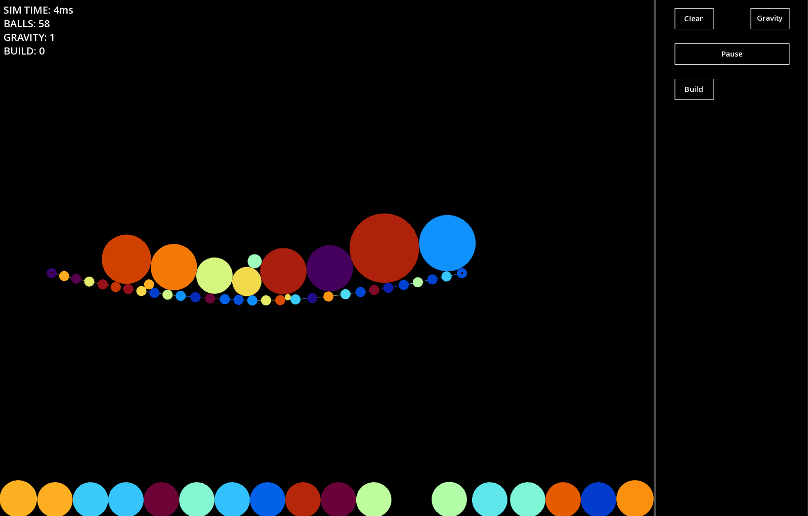
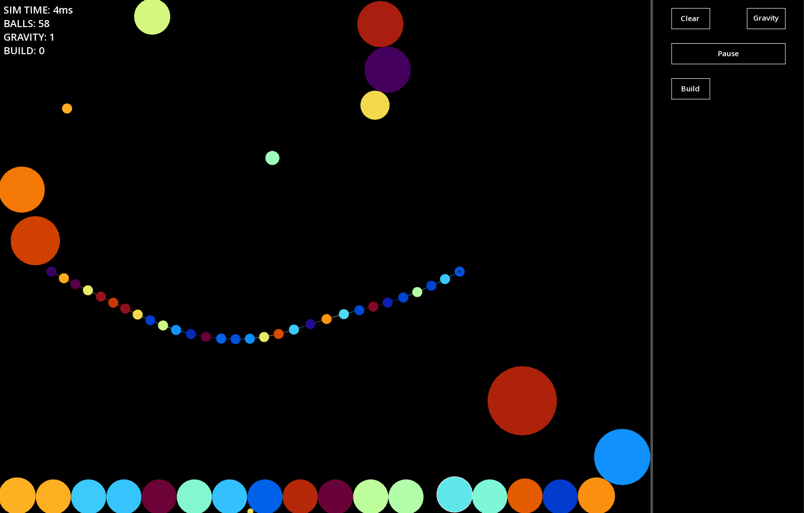

# ABOUT

A physics simulation written using C++ and using SFML for graphics. I had to learn about different phyiscs integrations
 which use Newton's laws of motion numerically. Choosing between Euler and Verlet integrations was difficult, however after watching 
  I decided to prioritise the accuracy of the physics. 

 Both  and  inspired me to 
 try my hand at a physics simulation.

 I also managed to use my own GUI elements of buttons for GUI. At the time of writing this there are not too many buttons, but those that are there 
 work perfectly, and look clean and blend with the rest of the background.

# Challenges

One of the most difficult features to implement was the ability to delete sticks and objects. As easy as it may sound out loud,
the way I had implemented the objects meant I had encountered many issues with memory, and stick connecting to non-existent objects!

After many days of trying to fix this issue, I decided to learn more about template classes, and made my own 'wrapper' for an 
std::vector, which allowed me to keep track of unique identifiers for each object, and using this finally fixed my issues of deletion.

While it may not be ideal, due to the many issues that templates can cause, I feel this suited my problem appropriately.

# Basic Demonstration 

The video below shows just some of the features and freedom that my physics simulation allows!

# IMAGES

#### Make Ropes!

#### Accurate Rope Physics!

#### Break and delete objects with correct interactions!

